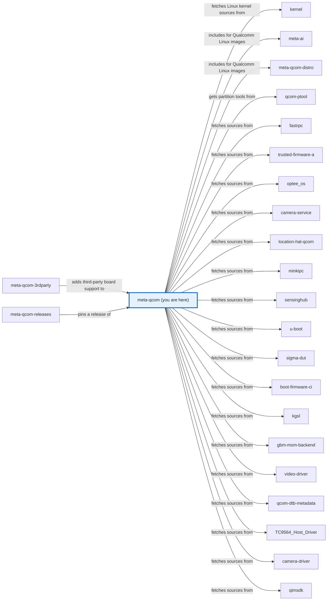
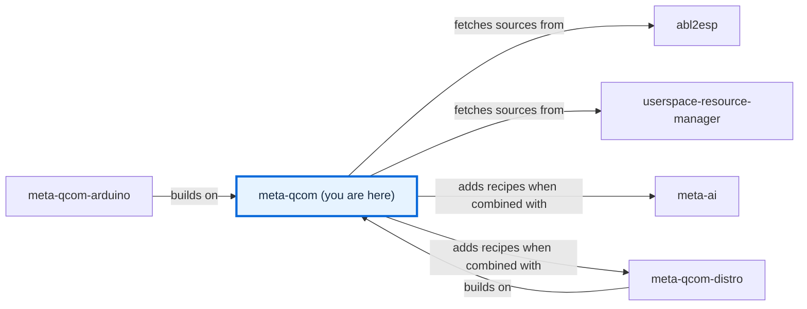

# meta-qcom

[)](https://github.com/qualcomm-linux/meta-qcom/actions/workflows/push.yml)
[)](https://github.com/qualcomm-linux/meta-qcom/actions/workflows/nightly-build.yml)
[)](https://github.com/qualcomm-linux/meta-qcom/actions/workflows/weekly-build.yml)

[)](https://github.com/qualcomm-linux/meta-qcom/actions/workflows/push.yml?query=branch%3Awrynose)
[)](https://github.com/qualcomm-linux/meta-qcom/actions/workflows/nightly-build.yml?query=branch%3Awrynose)

## Introduction


OpenEmbedded/Yocto Project hardware enablement layer for Qualcomm based platforms.

This layer provides additional recipes and machine configuration files for
Qualcomm platforms.

This layer depends on:

```text
URI: https://github.com/openembedded/openembedded-core.git
layers: meta
branch: master
revision: HEAD
```

This layer has an optional dependency on meta-oe layer:

```text
URI: https://github.com/openembedded/meta-openembedded.git
layers: meta-oe
branch: master
revision: HEAD
```

The dependency is optional, and not strictly required. When meta-oe is enabled
in the build (e.g. it is used in BBLAYERS) then additional recipes from
meta-qcom are added to the metadata. You can refer to meta-qcom/conf/layer.conf
for the implementation details.

## Branches

| Branch | Purpose and status | Build from it | Contributions |
| --- | --- | --- | --- |
| **master** | Primary development branch, with focus on upstream support and compatibility with the most recent Yocto Project release. Active. | Yes. | Pull requests go here. |
| **wrynose** | LTS branch based on the Yocto Project 6.0 release, used by Qualcomm Linux 2.x. Active. | Yes, for Qualcomm Linux 2.x. | Backports of changes merged to `master`. |
| **next** | For testing workflow changes before being merged to master. | No; build `master`. | Not documented. |
| **all stable branches up until styhead** (`styhead`, `scarthgap`, `kirkstone`, `honister`, `dunfell`, `zeus`, `warrior`, `thud`, `sumo`, `rocko`, `pyro`, `morty`, `krogoth`, `jethro`) | Legacy branches maintained by Linaro, prior to the migration to [Qualcomm-linux](https://github.com/qualcomm-linux). Only Yocto Project 5.0 (`scarthgap`) is still supported upstream. | Only with the Yocto Project release the branch is named after. | [SECURITY.md](SECURITY.md) accepts patches only for the LTS releases and `master`; of these branches only `scarthgap` is a current LTS release. `kirkstone`: raise an issue instead. |
| **backport/&lt;pull request&gt;-to-wrynose** | Temporary heads of automated backport pull requests into `wrynose`. | No; build `wrynose`. | Not documented. |

This table lists every branch. [BRANCHES.md](BRANCHES.md) describes their
maintenance, and the [contribution guide](CONTRIBUTING.md) says where changes
go.

## Machine Support

See [conf/machine](conf/machine/README.md) for the complete list of supported devices.

## Generic machine support

All contemporary boards are supported by a single qcom-armv8a machine. It can be
used instead of using the per-board configuration file. In order to enable
support for the particular device extend the qcom-armv8a.conf file.

## Quick build

Please refer to the [Yocto Project Reference Manual](https://docs.yoctoproject.org/ref-manual/system-requirements.html)
to set up your Yocto Project build environment.

Please follow the instructions below for a KAS-based build. The KAS tool offers
an easy way to setup bitbake based projects. For more details, visit the
[KAS documentation](https://kas.readthedocs.io/en/latest/index.html).

The steps below use `kas-container`, which runs the build inside a container,
so the only host requirements are a container runtime (Docker or Podman) and
the `kas-container` wrapper script — kas, bitbake and the build dependencies do
not need to be installed on the host.

1. Get the `kas-container` script on your `PATH`
   (from [kas-container](https://github.com/siemens/kas/blob/master/kas-container)).

2. Clone meta-qcom layer

    ```bash
    git clone https://github.com/qualcomm-linux/meta-qcom.git -b master
    ```

3. Build using the KAS configuration for one of the supported boards

    ```bash
    kas-container build meta-qcom/ci/rb3gen2-core-kit.yml
    ```

This reuses the same `ci/<board>.yml` configurations that CI uses. See
[AGENTS.md](AGENTS.md) for more advanced usage, including sharing the
`DL_DIR`/`SSTATE_DIR` caches across builds.

> **Note:** To run kas natively on the host instead of in a container, install
> kas by following the
> [kas installation guide](https://kas.readthedocs.io/en/latest/userguide/getting-started.html#installation),
> then use `kas build` in place of `kas-container build` in the steps above.

For a manual build without KAS, refer to the [Yocto Project Quick Build](https://docs.yoctoproject.org/brief-yoctoprojectqs/index.html).

## Flash

For instructions on building the QDL tool, preparing the board, and flashing
images over USB (EDL mode), see [Flashing images](docs/source/user/flashing.md).

## Security recommendations for production

Please refer to the security recommendations for production builds documented here:
[Security Recommendations](docs/source/user/security-recommendations.md)

## Releases

Milestone releases for meta-qcom are managed directly in this repository
using git tags. Each release tag captures the exact state of the layer for
that milestone, ensuring reproducible and stable builds. The list of available
release tags can be found on the
[meta-qcom tags page](https://github.com/qualcomm-linux/meta-qcom/tags).

To build a specific release, clone the repository at the desired release tag and
build it with KAS using the configuration for your target machine and distro.

1. Clone meta-qcom at the release tag

    ```bash
    git clone https://github.com/qualcomm-linux/meta-qcom.git -b <meta-qcom-release-tag>
    ```

   Replace `<meta-qcom-release-tag>` with the tag of the release you want to
   build (see the [tags page](https://github.com/qualcomm-linux/meta-qcom/tags)).

2. Build using the KAS configuration for your machine and distro

    ```bash
    kas build meta-qcom/ci/<machine>.yml:meta-qcom/ci/<distro>.yml
    ```

   Replace `<machine>` with the target board and `<distro>` with the desired
   distro configuration. For example:

    ```bash
    kas build meta-qcom/ci/rb3gen2-core-kit.yml:meta-qcom/ci/qcom-distro.yml
    ```

   Refer to `meta-qcom/ci/` for the complete list of available machine and
   distro configurations.

## Documentation

Open [docs/site/index.html](docs/site/index.html) directly in a browser for the
generated documentation site; the [documentation guide](docs/README.md) explains
how to rebuild it.

- [Flashing images](docs/source/user/flashing.md) — Flash a built image to an RB3 Gen 2 board and boot it.
- [Configuration reference](docs/source/user/CONFIGURATION.md) — Understand the kas fragments, layer, machine, and CI settings.
- [Development setup](docs/source/contributing/DEVELOPMENT.md) — Install the documentation tools and run the documentation checks.
- [Function reference](docs/site/contributing/README.html) — Browse the documented shell, BitBake, and Python functions in the generated site.

## Contributing

Please read [CONTRIBUTING.md](CONTRIBUTING.md) for the contribution workflow
and the commit subject and message requirements before opening a pull request.
Follow the [Code of Conduct](CODE_OF_CONDUCT.md) when participating.

## Communication

- **GitHub Issues:** [meta-qcom issues](https://github.com/qualcomm-linux/meta-qcom/issues)
- **Pull Requests:** [meta-qcom pull requests](https://github.com/qualcomm-linux/meta-qcom/pulls)

## Maintainer(s)

- Anuj Mittal <anuj.mittal@oss.qualcomm.com>
- Dmitry Baryshkov <dmitry.baryshkov@oss.qualcomm.com>
- Koen Kooi <koen.kooi@oss.qualcomm.com>
- Nicolas Dechesne <nicolas.dechesne@oss.qualcomm.com>
- Ricardo Salveti <ricardo.salveti@oss.qualcomm.com>
- Sourabh Banerjee <sbanerje@qti.qualcomm.com>
- Viswanath Kraleti <viswanath.kraleti@oss.qualcomm.com>

## License

This layer is licensed under the MIT license. Check out [LICENSE](LICENSE)
for more details. [Third-party notices](docs/THIRD_PARTY_NOTICES.md) cover the
documentation tooling and templates adapted from other projects.

## Folders

- [.github/](.github/) — Holds the CI workflows and actions, CODEOWNERS, issue and pull request templates, Markdown lint settings, and documentation build helpers.
- [ci/](ci/README.md) — Contains the kas build fragments, their lock file, and the CI helper scripts.
- [classes/](classes/README.md) — Contains BitBake classes for global use, such as boot images and download mirrors.
- [classes-recipe/](classes-recipe/README.md) — Contains BitBake classes that recipes and images inherit.
- [conf/](conf/README.md) — Contains the layer configuration and the machine configurations.
- [docs/](docs/README.md) — Contains the documentation source, the generated site, and third-party notices.
- [dynamic-layers/](dynamic-layers/README.md) — Contains recipes that apply only when other layers are present.
- [lib/](lib/README.md) — Contains the layer's Python helpers and oe-selftest cases.
- [licenses/](licenses/README.md) — Contains Qualcomm licence texts that recipes reference.
- [patches/](patches/README.md) — Contains patches that the kas configuration applies to other layers.
- [recipes-bsp/](recipes-bsp/README.md) — Contains board support recipes: firmware, boot loaders, device trees, partitions, and package groups.
- [recipes-connectivity/](recipes-connectivity/README.md) — Contains connectivity test tool recipes.
- [recipes-core/](recipes-core/README.md) — Contains core system customisations, such as systemd settings.
- [recipes-devtools/](recipes-devtools/README.md) — Contains host and target tools for flashing, signing, and inspecting images.
- [recipes-graphics/](recipes-graphics/README.md) — Contains GPU driver, graphics, and Wayland recipes.
- [recipes-kernel/](recipes-kernel/README.md) — Contains kernel, kernel module, firmware, and boot image recipes.
- [recipes-ml/](recipes-ml/README.md) — Contains machine learning runtime recipes.
- [recipes-multimedia/](recipes-multimedia/README.md) — Contains camera, computer vision, and multimedia recipes.
- [recipes-support/](recipes-support/README.md) — Contains support services and libraries for Qualcomm platforms.
- [recipes-test/](recipes-test/README.md) — Contains test tools and test images.

## Files

- [.env.example](.env.example) — Lists the environment settings that kas and the CI helper scripts read.
- [.gitignore](.gitignore) — Keeps generated CI files, local environments, and documentation build intermediates out of version control.
- [AGENTS.md](AGENTS.md) — Guides automation agents to build and check the layer the way CI does.
- [BRANCHES.md](BRANCHES.md) — Describes each branch's purpose, status, and relationship to `master`.
- [CLAUDE.md](CLAUDE.md) — Links to AGENTS.md for agents that read this file name.
- [CODE_OF_CONDUCT.md](CODE_OF_CONDUCT.md) — States participation standards and the private conduct-reporting route.
- [CONTRIBUTING.md](CONTRIBUTING.md) — Points to the contribution guide and development setup.
- [LICENSE](LICENSE) — Contains the layer's MIT licence.
- [README](README) — Links to this README.
- [README.md](README.md) — Introduces the layer, its branches, documentation, and contents.
- [SECURITY.md](SECURITY.md) — Explains how to report vulnerabilities and which branches receive security fixes.

<!-- repository-map:start -->

## Repository map

### Connections (1/2)



### Connections (2/2)



[Full Qualcomm repository map](https://github.com/devdocsorg/qualcomm-repository-map).

<!-- Generated from https://github.com/devdocsorg/qualcomm-repository-map at 6de44bbfbb53f1cca98d19df220a03070a28612e; dataset SHA-256: 7d3dfab698b6ee92cd91d184225edb3d5b14ddb75e213d1d2ab26ae09719a6b3. -->

<!-- repository-map:end -->
