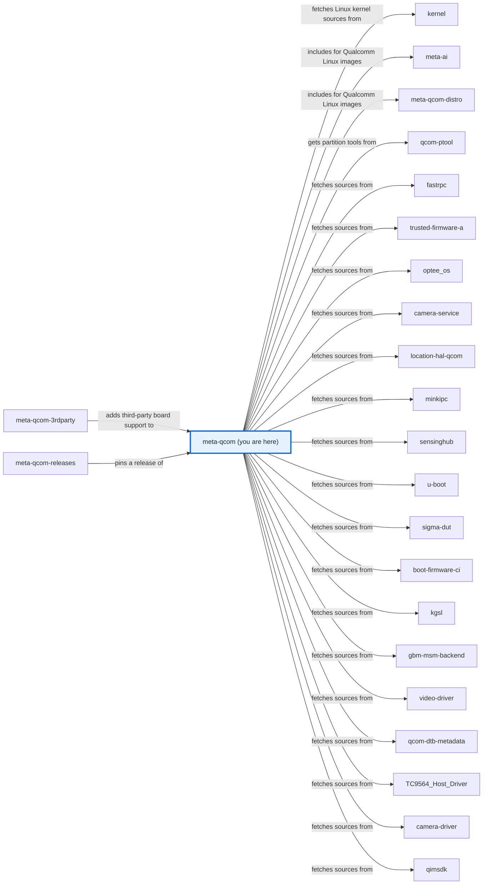
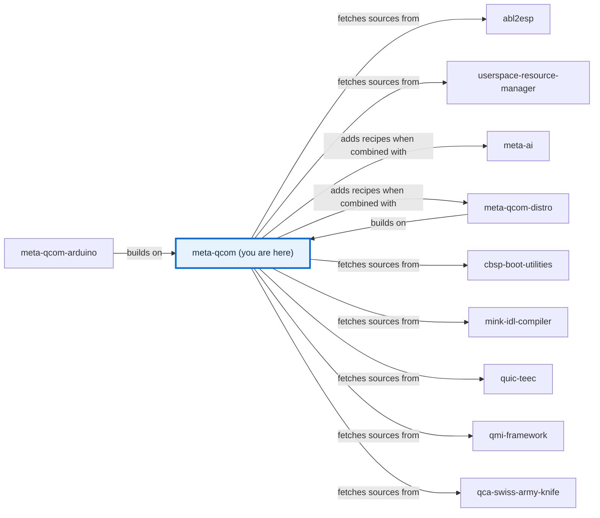

# meta-qcom

[)](https://github.com/qualcomm-linux/meta-qcom/actions/workflows/push.yml)
[)](https://github.com/qualcomm-linux/meta-qcom/actions/workflows/nightly-build.yml)
[)](https://github.com/qualcomm-linux/meta-qcom/actions/workflows/weekly-build.yml)

[)](https://github.com/qualcomm-linux/meta-qcom/actions/workflows/push.yml?query=branch%3Awrynose)
[)](https://github.com/qualcomm-linux/meta-qcom/actions/workflows/nightly-build.yml?query=branch%3Awrynose)

## Introduction


OpenEmbedded/Yocto Project hardware enablement layer for Qualcomm based platforms.

This layer provides additional recipes and machine configuration files for
Qualcomm platforms.

This layer depends on:

```text
URI: https://github.com/openembedded/openembedded-core.git
layers: meta
branch: master
revision: HEAD
```

This layer has an optional dependency on meta-oe layer:

```text
URI: https://github.com/openembedded/meta-openembedded.git
layers: meta-oe
branch: master
revision: HEAD
```

The dependency is optional, and not strictly required. When meta-oe is enabled
in the build (e.g. it is used in BBLAYERS) then additional recipes from
meta-qcom are added to the metadata. You can refer to [meta-qcom/conf/layer.conf](conf/layer.conf)
for the implementation details.

## Branches

| Branch | Purpose | Status | Build from it | Contributions |
| --- | --- | --- | --- | --- |
| **master** | Primary development branch, with focus on upstream support and compatibility with the most recent Yocto Project release. | Active | Yes | Yes, see [CONTRIBUTING.md](CONTRIBUTING.md) |
| **wrynose** | LTS branch based on the Yocto Project 6.0 release, used by Qualcomm Linux 2.x. | Active LTS | Yes | Backports from master, see [CONTRIBUTING.md](CONTRIBUTING.md) |
| **backport/&lt;pr&gt;-to-wrynose** | Temporary branches that the backport automation opens pull requests from. | Temporary | Only to test the backport | Review the backport pull request |
| **next** | For testing workflow changes before being merged to master. | Test branch | Builds like master; meant for workflow tests | Not documented |
| **kirkstone** | Legacy branch maintained by Linaro, prior to the migration to [Qualcomm-linux](https://github.com/qualcomm-linux). | Yocto Project support ended | Only with kirkstone layers | Not open for direct contributions, see [CONTRIBUTING.md](CONTRIBUTING.md) |
| **all other stable branches up until styhead** (dunfell, honister, jethro, krogoth, morty, pyro, rocko, scarthgap, styhead, sumo, thud, warrior, zeus) | Legacy branches maintained by Linaro, prior to the migration to [Qualcomm-linux](https://github.com/qualcomm-linux). | Inactive since 2025 or earlier | Only with the matching release's layers | Current policy not documented; see [BRANCHES.md](BRANCHES.md) for the routes their READMEs name |

This table lists every current branch. [BRANCHES.md](BRANCHES.md) gives each
branch's support status, history, and relationship to master.

## Machine Support

See [conf/machine](conf/machine/README.md) for the complete list of supported devices.

## Generic machine support

All contemporary boards are supported by a single qcom-armv8a machine. It can be
used instead of using the per-board configuration file. In order to enable
support for the particular device extend the qcom-armv8a.conf file.

## Quick build

Please refer to the [Yocto Project Reference Manual](https://docs.yoctoproject.org/ref-manual/system-requirements.html)
to set up your Yocto Project build environment.

Please follow the instructions below for a KAS-based build. The KAS tool offers
an easy way to setup bitbake based projects. For more details, visit the
[KAS documentation](https://kas.readthedocs.io/en/latest/index.html).

The steps below use `kas-container`, which runs the build inside a container,
so the only host requirements are a container runtime (Docker or Podman) and
the `kas-container` wrapper script — kas, bitbake and the build dependencies do
not need to be installed on the host.

1. Get the `kas-container` script on your `PATH`
   (from [kas-container](https://github.com/siemens/kas/blob/master/kas-container)).

2. Clone meta-qcom layer

    ```bash
    git clone https://github.com/qualcomm-linux/meta-qcom.git -b master
    ```

3. Build using the KAS configuration for one of the supported boards

    ```bash
    kas-container build meta-qcom/ci/rb3gen2-core-kit.yml
    ```

This reuses the same `ci/<board>.yml` configurations that CI uses. See
[AGENTS.md](docs/source/contributing/AGENTS.md) for more advanced usage, including sharing the
`DL_DIR`/`SSTATE_DIR` caches across builds, and the
[configuration guide](docs/source/user/CONFIGURATION.md) for what each kas file sets.

> **Note:** To run kas natively on the host instead of in a container, install
> kas by following the
> [kas installation guide](https://kas.readthedocs.io/en/latest/userguide/getting-started.html#installation),
> then use `kas build` in place of `kas-container build` in the steps above.

For a manual build without KAS, refer to the [Yocto Project Quick Build](https://docs.yoctoproject.org/brief-yoctoprojectqs/index.html).

## Flash

For instructions on building the QDL tool, preparing the board, and flashing
images over USB (EDL mode), see [Flashing images](docs/source/user/USAGE.md).

## Security recommendations for production

Please refer to the security recommendations for production builds documented here:
[Security Recommendations](docs/source/user/security-recommendations.md)

## Releases

Milestone releases for meta-qcom are managed directly in this repository
using git tags. Each release tag captures the exact state of the layer for
that milestone, ensuring reproducible and stable builds. The list of available
release tags can be found on the
[meta-qcom tags page](https://github.com/qualcomm-linux/meta-qcom/tags).

To build a specific release, clone the repository at the desired release tag and
build it with KAS using the configuration for your target machine and distro.

1. Clone meta-qcom at the release tag

    ```bash
    git clone https://github.com/qualcomm-linux/meta-qcom.git -b <meta-qcom-release-tag>
    ```

   Replace `<meta-qcom-release-tag>` with the tag of the release you want to
   build (see the [tags page](https://github.com/qualcomm-linux/meta-qcom/tags)).

2. Build using the KAS configuration for your machine and distro

    ```bash
    kas build meta-qcom/ci/<machine>.yml:meta-qcom/ci/<distro>.yml
    ```

   Replace `<machine>` with the target board and `<distro>` with the desired
   distro configuration. For example:

    ```bash
    kas build meta-qcom/ci/rb3gen2-core-kit.yml:meta-qcom/ci/qcom-distro.yml
    ```

   Refer to [meta-qcom/ci/](ci/README.md) for the complete list of available machine and
   distro configurations.

## Contributing

Please read [CONTRIBUTING.md](CONTRIBUTING.md) for where to send changes, the
contribution workflow, and the commit subject and message requirements before
opening a pull request. Follow the [Code of Conduct](CODE_OF_CONDUCT.md) when
participating.

## Communication

- **GitHub Issues:** [meta-qcom issues](https://github.com/qualcomm-linux/meta-qcom/issues)
- **Pull Requests:** [meta-qcom pull requests](https://github.com/qualcomm-linux/meta-qcom/pulls)

## Maintainer(s)

- Anuj Mittal <anuj.mittal@oss.qualcomm.com>
- Dmitry Baryshkov <dmitry.baryshkov@oss.qualcomm.com>
- Koen Kooi <koen.kooi@oss.qualcomm.com>
- Nicolas Dechesne <nicolas.dechesne@oss.qualcomm.com>
- Ricardo Salveti <ricardo.salveti@oss.qualcomm.com>
- Sourabh Banerjee <sbanerje@qti.qualcomm.com>
- Viswanath Kraleti <viswanath.kraleti@oss.qualcomm.com>

## Documentation

Open [docs/site/index.html](docs/site/index.html) directly in a browser for the
generated documentation site; the [documentation guide](docs/README.md) explains
where its source lives and how to rebuild it.

- [Flashing images](docs/source/user/USAGE.md) — Flash a built image onto a board.
- [Configuration](docs/source/user/CONFIGURATION.md) — Understand the kas files, layer settings, and layer variables.
- [Development setup](docs/source/contributing/DEVELOPMENT.md) — Run the layer checks and rebuild the documentation.
- [Function reference](docs/site/contributing/README.html#function-reference) — Read the documented tasks and functions of every recipe, class, and script.

## Folders

- [.github/](.github/) — Holds CODEOWNERS, issue and pull request templates, CI workflows and actions, the Markdown lint settings, and the documentation build helpers.
- [ci/](ci/README.md) — Holds the kas files and helper scripts that CI and local builds use.
- [classes/](classes/README.md) — Holds global classes for boot images, DTB images, the download mirror, and ESP images.
- [classes-recipe/](classes-recipe/README.md) — Holds recipe classes for FIT DTB images, adbd, the qcomflash image type, and UEFI capsules.
- [conf/](conf/README.md) — Holds the layer configuration and the machine configurations.
- [docs/](docs/README.md) — Holds the documentation source and the generated site.
- [dynamic-layers/](dynamic-layers/README.md) — Holds recipes that apply only when another layer is present.
- [lib/](lib/README.md) — Holds the layer's Python helpers and oe-selftest cases.
- [licenses/](licenses/) — Holds the Qualcomm licence texts that recipes name.
- [patches/](patches/README.md) — Holds patches that the kas files apply to other layers.
- [recipes-bsp/](recipes-bsp/README.md) — Holds board support recipes: firmware, boot loaders, partitions, images, and packagegroups.
- [recipes-connectivity/](recipes-connectivity/README.md) — Holds connectivity recipes.
- [recipes-core/](recipes-core/README.md) — Holds changes to core system recipes.
- [recipes-devtools/](recipes-devtools/README.md) — Holds host and target tools for building, signing, and flashing images.
- [recipes-graphics/](recipes-graphics/README.md) — Holds GPU drivers and graphics stack changes.
- [recipes-kernel/](recipes-kernel/README.md) — Holds kernels, kernel modules, firmware, and boot partition images.
- [recipes-ml/](recipes-ml/README.md) — Holds the Qualcomm AI Runtime SDK recipe.
- [recipes-multimedia/](recipes-multimedia/README.md) — Holds camera, computer vision, GStreamer, and IMSDK recipes.
- [recipes-support/](recipes-support/README.md) — Holds Qualcomm support services and libraries.
- [recipes-test/](recipes-test/README.md) — Holds test tools and test images.

## Files

- [.env.example](.env.example) — Lists the environment variables the helper scripts read, with safe examples.
- [.gitignore](.gitignore) — Keeps generated files, local settings, and the documentation environment out of version control.
- [AGENTS.md](AGENTS.md) — Points automation agents to the agent guide.
- [BRANCHES.md](BRANCHES.md) — Describes each branch's purpose, status, and relationship to master.
- [CLAUDE.md](CLAUDE.md) — Links to AGENTS.md for agents that read this name.
- [CODE_OF_CONDUCT.md](CODE_OF_CONDUCT.md) — States the expected behaviour and how to report conduct concerns.
- [CONTRIBUTING.md](CONTRIBUTING.md) — Points to the contribution guide.
- [LICENSE](LICENSE) — Contains the layer's MIT licence.
- [NOTICE](NOTICE) — Keeps the licences of adapted documentation tooling and templates.
- [README](README) — Links to this README.
- [README.md](README.md) — Introduces the layer, its branches, and its contents.
- [SECURITY.md](SECURITY.md) — Explains how to report vulnerabilities.

## License

This layer is licensed under the MIT license. Check out [LICENSE](LICENSE)
for more details. [NOTICE](NOTICE) keeps the licences of the adapted
documentation tooling and templates.

<!-- repository-map:start -->

## Repository map

### Connections (1/2)



### Connections (2/2)



[Full Qualcomm repository map](https://github.com/devdocsorg/qualcomm-repository-map).

<!-- Generated from https://github.com/devdocsorg/qualcomm-repository-map at a438186a36e9651d516c6879c3a5f9264e72d946; dataset SHA-256: 1f560a9079de2040be620288a3baf490edcce6889ba27abd4ea74d34aa0c523a. -->

<!-- repository-map:end -->
